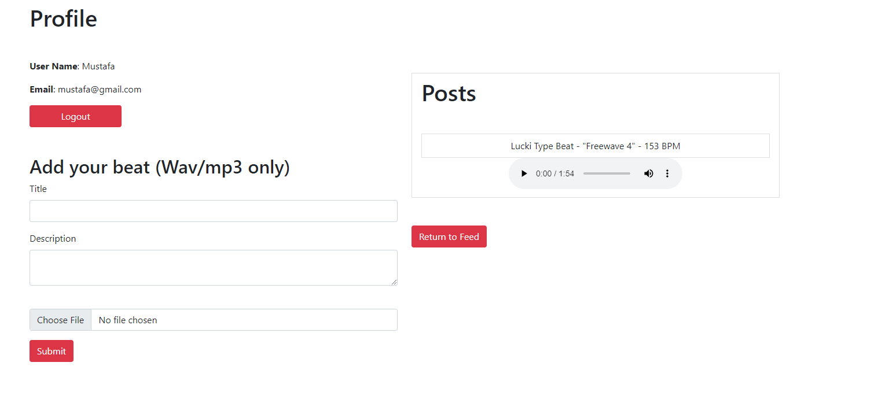
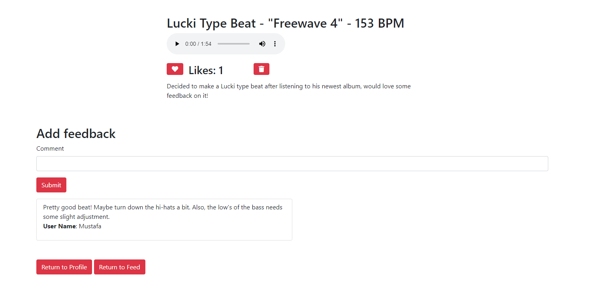

## Feedbacko

---

Feedbacko is a full-stack web application focused on feedback. Users can give and receive feedback on their music.

---

## Screenshots

Users can post their beats/songs by going to their profile. They can also see all of their posts listed on there.

---

The feed shows the songs/beats that you can give feedback to

---
Once one clicks on an individual post through the feed or on their own profile, they can take a look at the given feedback, amount of likes, and even delete the post if it was created by them

# Install

`npm install`

---

# Things to add

- Create a `.env` file in config folder and add the following as `key = value`
  - PORT = 2121 (can be any port example: 3000)
  - DB_STRING = `your database URI`
  - CLOUD_NAME = `your cloudinary cloud name`
  - API_KEY = `your cloudinary api key`
  - API_SECRET = `your cloudinary api secret`

---

# Run

2. `npm start`
